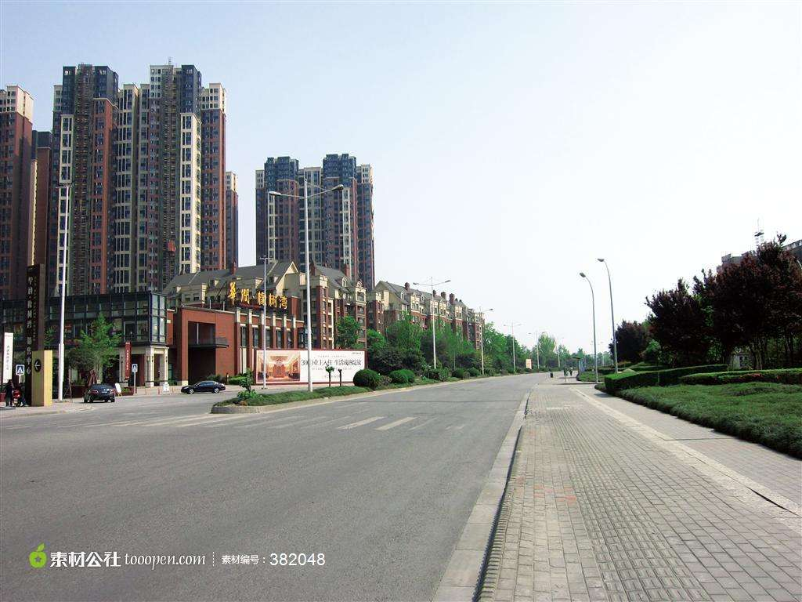
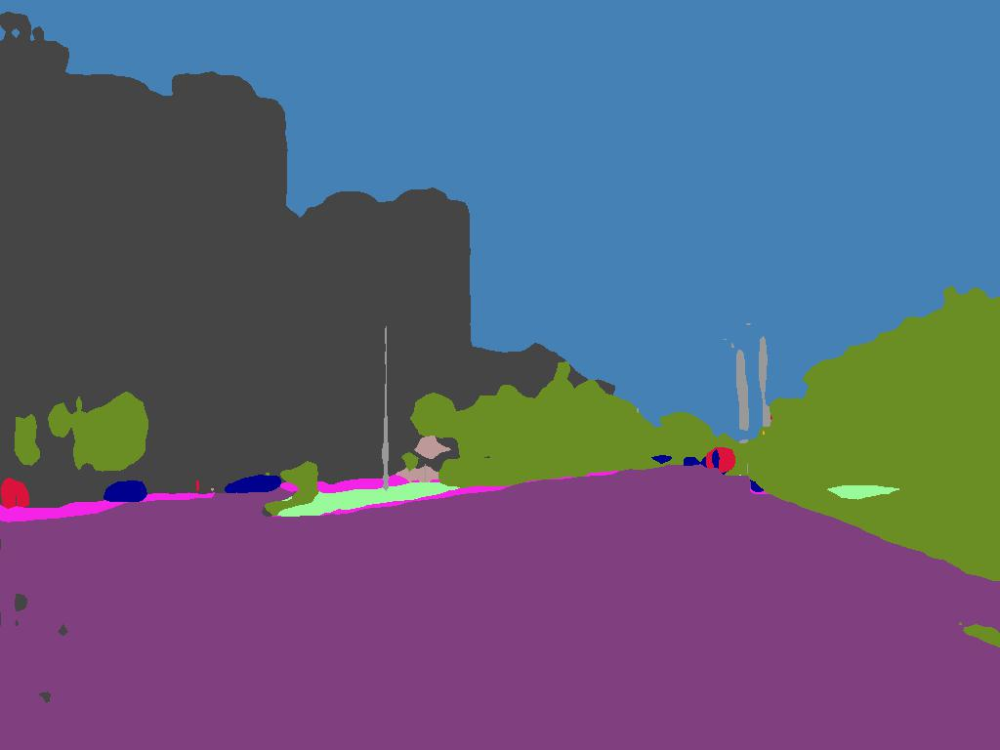
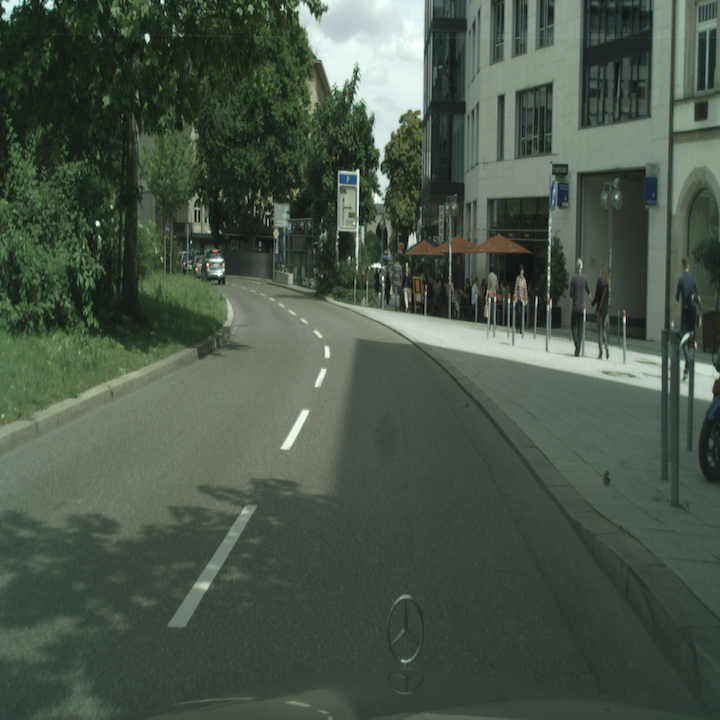
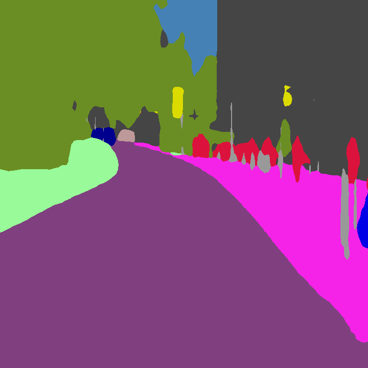

### Paper
> `Pyramid Scene Parsing Network.pdf`

### Run Image
1. 下载模型[Google Drive](https://drive.google.com/open?id=0B9CKOTmy0DyaV09LajlTa0Z2WFU)，放入`model` 目录.
2. 准备图片，运行`RunnerOne.py` 即可:  
    `Runner(is_flip=False, num_classes=19, log_dir="./model", save_dir="./output").run("data/input/test.png")`

### Run Result
Input image                 |  Output image
:--------------------------:|:---------------------------:
 | 
 | 

### 1. Data - ImageReader.py
- `ReaderTrainImageAndLabel` 
    - 多线程读取训练的图片和标签
- `ReaderTestImage`
    - 多线程读取测试的图片

### 2. Model - PSPNet.py
- `Network`
    - 定义网络的基本操作
- `PSPNet`
    - 定义网络的具体结构

### 3. Tool - Tools.py
- `Tools`
    - 工具类

### 4. Runner - RunnerXXX.py
- `RunnerTrain.py`
    - 训练模型，输入是训练图片和标签的list，输出是训练好的模型
- `RunnerOne.py`
    - 使用模型，输入是一张图片，输出是语义分割结果
- `RunnerAll.py`
    - 使用模型，输入是图片的list，输出是语义分割结果

### Reference
* [hellochick/PSPNet-tensorflow](https://github.com/hellochick/PSPNet-tensorflow)
